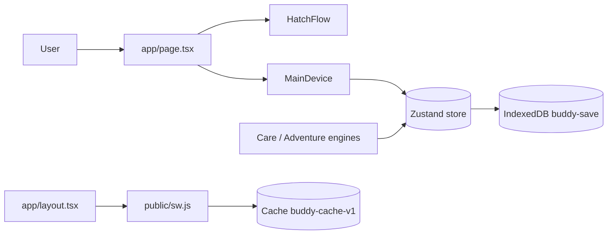

# Architecture and Trust Model

This document records the runtime topology of `buddy` and the trust assumptions the current
build relies on. It closes audit finding `ARCH-P1-001` ("Entire game is client-authoritative with
no server trust boundary") by making the guest-only trust model explicit. It does not add a
server; the account/cloud work it describes is future platform work.

## Current topology: client-authoritative, local-first SPA

`buddy` at this commit is a **pure client-side application**. There is no backend, no API layer,
no database, no queue, no webhook, no realtime channel, and no authentication.

| Layer | Where | Responsibility |
|---|---|---|
| Router / shell | `app/page.tsx`, `app/layout.tsx` | single client route; loads the game |
| State | `lib/buddy/store.ts` (Zustand) | in-memory game state (`buddy`, `inventory`, `guestId`) |
| Game rules | `lib/actions/care.ts`, `lib/locations/adventure.ts` | compute needs, XP, coins, loot in the browser |
| Persistence | `lib/storage/indexeddb.ts` | writes the save envelope directly to browser IndexedDB |
| Offline shell | `public/sw.js`, `lib/offline/sw.ts` | cache-first service worker for the app shell |

There is no server entry point. `next.config.js` sets `output: "standalone"`, which can imply a
Node server deployment, but no server code exists at this commit; the deployment shape is an
unresolved question (see below).

## Trust model (current): the client is authoritative, for a single guest

Because every state transition and reward is computed and persisted on the client:

- The save envelope in IndexedDB is **user-editable**. A user can modify coins, items, XP, or
  stats and reload the game; the client trusts whatever it loads.
- There is **no server-side validation, rate limiting, or duplicate/replay rejection**.
- There is **no identity guarantee**: `guestId` is a local identifier, not an authenticated
  principal, and offers no ownership or anti-tamper property.

This is an accepted model **only for the shipped, offline, single-player guest experience**. It
is not a security control and must not be treated as one.

## Required model before account, cloud, or competitive features

The repository's own spec,
`docs/prompts/buddy_virtual_pet_v2_complete_prompt_pack/specs/security-economy-authority.md`,
states that for account mode *"client state is not authoritative for rare rewards, inventory
mutations, cloud saves, or adventure completion."* Before any account, cloud-sync, ranked, or
monetized feature ships, the following must exist (the spec's required controls):

- A server/edge trust boundary that validates the save envelope on load and save.
- Server-side validation of adventure start/complete and inventory use/sell.
- Rate limiting on reward endpoints.
- Recording and rejection of impossible stats, duplicate rewards, and replayed completions.

Until that boundary exists, features that depend on trustworthy state must not be enabled. The
current validation expectation is a documentation check that this trust model is stated; once a
server validator exists, add tests asserting that a tampered save is rejected.

## Open questions

| Question | Why it matters | Evidence needed |
|---|---|---|
| Static export or Node server? | `output: "standalone"` with no server code | deployment config |
| Is account/Supabase still planned? | drives the P1 server-authority work | product roadmap |

## References

- `docs/prompts/buddy_virtual_pet_v2_complete_prompt_pack/specs/security-economy-authority.md`
- `next.config.js` (`output: "standalone"`, `images.unoptimized`)
- `lib/buddy/store.ts`, `lib/storage/indexeddb.ts`, `lib/actions/care.ts`,
  `lib/locations/adventure.ts`, `public/sw.js`
